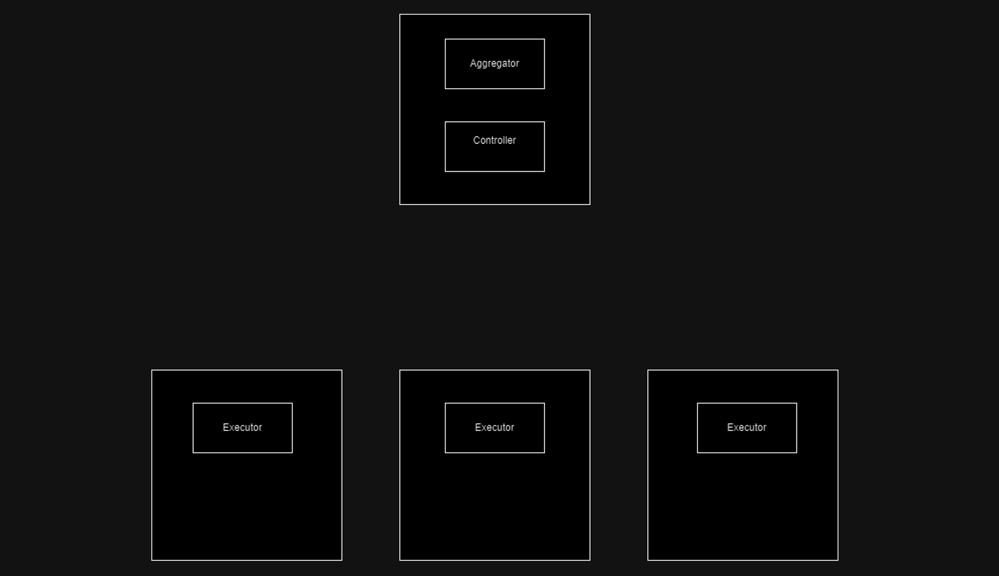

# Key Concepts and Workflow Reference

### Core Components
1. **Controller**: 
   - Runs on the central node or server.
   - Manages the distribution of tasks and aggregation of results.

2. **Executor**: 
   - Runs on edge nodes or sites.
   - Responsible for executing tasks received from the Controller.

3. **Tasks**: 
   - Units of work that the Controller sends to Executors.
   - May contain data (passed via Shareables) and optional callback functions.

4. **Shareables**: 
   - The structure used to pass data between the Controller and Executors.
   - Can be empty if no data needs to be passed.

5. **Aggregator**: 
   - A component that collects results from multiple sites.
   - Can be invoked by the Controller to aggregate results after all Executors have completed their tasks.

6. **Callback**: 
   - A function associated with a Task, which is executed when an Executor returns results.
   - Can be used to persist or process results, for example, sending them to the Aggregator.

---

### Workflow Overview

1. **Broadcast Task**:
   - The Controller broadcasts a Task to all Executors across different sites. 
   - The Task may contain data packaged as a Shareable.

2. **Executor Computation**:
   - Executors receive the Task, process it, and return results (also as Shareables) to the Controller.

3. **Callback Execution (Optional)**:
   - If a callback function is associated with the Task, it gets executed upon the return of results from an Executor.
   - The callback can pass the result to the Aggregator component for storage or further processing.

4. **Aggregation**:
   - Once all Executors have returned their results, the Controller triggers the Aggregator’s `Aggregate()` method to combine the results into a final, aggregated outcome.

5. **Broadcast Results**:
   - The Controller then broadcasts the aggregated results back to all the participating Executors/sites.

---

### Example Workflow in Action

1. **Step 1 - Broadcast Task**  
   The Controller sends out a task to all site Executors, instructing them to perform the required computation.

2. **Step 2 - Accept Results**  
   Each Executor completes its assigned task and returns the results to the Controller. The Controller collects all site results and can forward them to the Aggregator, depending on the task's callback.

3. **Step 3 - Aggregate**  
   The Aggregator processes the results from the Executors and produces a single aggregated result via the `Aggregate()` method.

4. **Step 4 - Broadcast Results**  
   Once aggregation is complete, the Controller broadcasts the final results to all sites.

---

### Visual Reference

